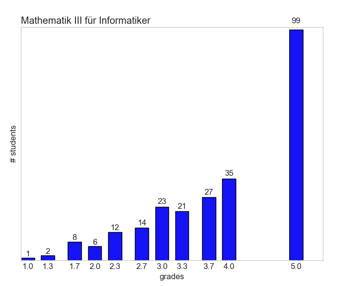

# Export your grades
... and start comparing yourself to other students. It's a totally sane thing to do.

Outputs the difference of your grades to the grades of the others.

Caveat: Only exports grades where the Notenspiegel is available. This is by choice, not accident - so technically no caveat but will be perceived as one.

```bash
# Needed: python3 and pip3 or pip.exe or whatever
pip3 install mechanicalsoup
pip3 install argparse

python3 grades_extractor.py TUCAN_USERNAME PASSWORD
# grades.json will now hold the grades data

# If you'd like to plot the notenspiegel, just do:
pip3 install matplotlib
pip3 install numpy
python3 grades_notenspiegel_plotter.py TUCAN_USERNAME PASSWORD
# the plots will reside in the newly created output folder
```

## TODO:
- Get better grades...
- Remind Micha to install a sane OS where `pip` is not `pip.exe`

