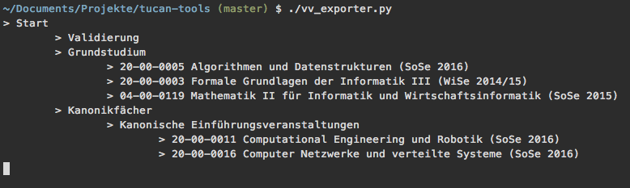

# Export your grades
... and start comparing yourself to other students. It's a totally sane thing to do.

You can also export the Vorlesungszeichnis of the current semester (see below).


```bash
# Needed: python3 and pip3 or pip.exe or whatever, and:
pip3 install -r requirements.txt

# To export the grades:
# You will get prompted for your username/password
# or you can create a file called 'user-credentials.txt' with two lines in it:
# your username and password (trailing whitespace etc. will be stripped)
python3 grades_extractor.py
# (grades.json)

# To plot the notenspiegel:
# If there is an error that you need 'tkinter' you have to install 'python-pmw' (Arch Linux)
pip3 install matplotlib
pip3 install numpy
python3 grades_notenspiegel_plotter.py
# (plots will reside in newly created 'output' folder)
```

## Grade Change Detector
You can watch for changes of your grades automatically using the `detect_grade_change.py` executable.
Executing it retrieves the grades and saves them in the `grades/` directory.
The next execution then also retrieves the grades and compares them with the most recent saved `grades/` file.
If there are changes, it notifies you using the [notify2](https://notify2.readthedocs.io/en/latest/) library.

Since the `detect_grade_change.py` executable does no automatic scheduling, you may add an entry to your crontab (or create a service):
```cron
0 * * * * cd FOLDER_WHERE_THE_TUCAN_TOOLS_ARE/tucan-tools && PATH_TO_YOUR_PYTHON_EXECUTABLE/python3 detect_grade_change.py
```
**Note** If you use a version manager, like anaconda or virtualenv, you have to manually define the executable path. Otherwise you can remove the `PATH_TO_YOUR_PYTHON_EXECUTABLE/` part. 

This will check for changes in the grades each hour.


## Vorlesungsverzeichnis Exporter
You can export the Vorlesungszeichnis:
```shell
python3 vv_exporter.py
```
The `modules.json` will now reside in the folder.

You can display the VV with the [tucan-catalog](https://github.com/davidgengenbach/tucan-catalog). See the repo README for that.

The VV exporter crawls the _Anmeldung_ page, not the _VV_ page in TuCan! There are small but irrelevant differences between these two pages. The crawler uses the _Anmeldung_ page in TuCan, because it contains additional infos (like the credit-points of a module).

## Caveats
- Only exports grades where the Notenspiegel is available. This is by choice, not accident - so technically no caveat but will be perceived as one.
- Once the `grades.json` got extracted from TuCan, it will be reused whenever possible. So if there are grades/courses missing, just delete the `grades.json` and try again.

[](https://travis-ci.org/tucanlib/tucan-tools)

## TODO
- Get better grades...
- Remind Micha to install a sane OS where `pip` is not `pip.exe`


## Screenshots

#### Notenspiegel Plot


#### Leistungsspiegel Export
_Ja, das sind meine echten Noten :smile:_


#### VV Export


